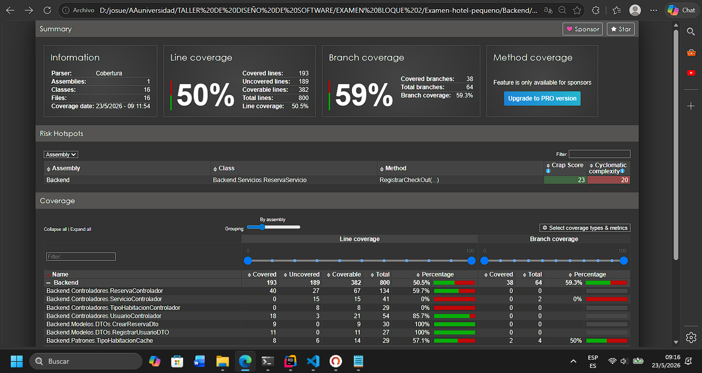
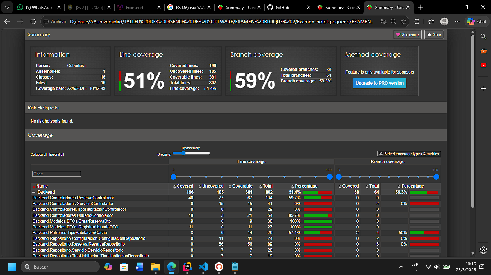

# EC2 — Defensa en Vivo · Primera Instancia
## Taller de Diseño de Software I
**Estudiante:** Balbontin Ugarteche Josue Galo
**Fecha:** sábado 23 de mayo de 2025  
**Proyecto trabajado en esta defensa:** [hotel-pequeño-backend]
**Repositorio del proyecto:** https://github.com/josue-balbontin/Examen-hotel-pequeno


> ⚠️ Prohibido el uso de IA durante este examen.
> Responde con tus propias palabras. Las preguntas se refieren a lo que hagas aquí, no a tu reporte anterior.

---

## Paso 1 · Reporte de cobertura actual

Antes de tocar cualquier código, genera el reporte de cobertura del proyecto que vas a trabajar.

- Herramienta utilizada: reportgenerator ,coveragereport 
- Link al reporte generado: ./coveragereportinicial

 

---

## Paso 2 · Code smell a refactorizar

Identifica un code smell en tu código y refactorízalo.

**Tipo de code smell:**

 Reserva servicio RegistrarCheckOut : Long Method

**¿Por qué este fragmento es un code smell? ¿Qué problema real podría causar si se deja así?**
> El metodo RegistrarCheckOut es un metodo largo, con muchas lineas de codigo, lo que dificulta su lectura y mantenimiento. Si se deja así, podría ser dificil identificar errores o hacer cambios en el futuro ademas que implementa otra logica no siendo responsabilidad unica.

**Código original (snippet — sin capturas):**
```
 public void RegistrarCheckOut(int idReserva)
    {
        var reserva = _repositorio.ObtenerPorId(idReserva) ?? throw new ArgumentException("Reserva no encontrada.");
        
        if (reserva.FechaCheckin == null)
        {
            throw new InvalidOperationException("No se puede registrar check-out sin check-in previo.");
        }

        if (reserva.FechaCheckout != null)
        {
            throw new InvalidOperationException("El check-out ya fue registrado previamente.");
        }

        if (reserva.FechaSalida == null)
        {
            throw new InvalidOperationException("La reserva no tiene fecha de salida definida.");
        }

        var ahora = DateTime.UtcNow;
        reserva.FechaCheckout = ahora;

        var horaLimiteStr = _configuracionRepositorio.ObtenerValor("hora_limite_checkout", "12:00");
        var porcentajeStr = _configuracionRepositorio.ObtenerValor("porcentaje_late_checkout", "0.50");

        var horaLimite = TimeSpan.Parse(horaLimiteStr, CultureInfo.InvariantCulture);
        var porcentajeRecargo = decimal.Parse(porcentajeStr, CultureInfo.InvariantCulture);
        
        
        var hoy = DateOnly.FromDateTime(DateTime.Now);
        var salida = reserva.FechaSalida.Value;
        var horaActual = DateTime.Now.TimeOfDay;

        var excedeFechaSalida = hoy > salida;
        var excedeHoraEnMismaFecha = hoy == salida && horaActual > horaLimite;

        var cargo = 0m;

        if (excedeFechaSalida || excedeHoraEnMismaFecha)
        {
            if (reserva.IdHabitacionesNavigation?.IdTipoHabitacion == null)
            {
                throw new InvalidOperationException("No se pudo determinar el tipo de habitación para calcular el recargo.");
            }

            var idTipoHabitacion = reserva.IdHabitacionesNavigation.IdTipoHabitacion.Value;
            var cache = TipoHabitacionCache.ObtenerInstancia();
            decimal? precio = null;
            

            var detalleReserva = reserva.IdHabitacionesNavigation.IdTipoHabitacionNavigation;
            if (detalleReserva != null)
            {
                    cache.Datos[idTipoHabitacion] = detalleReserva;
                    precio = detalleReserva.PrecioReferencia;
            }
            

            if (precio == null)
            {
                throw new InvalidOperationException("No se encontró un precio de referencia para el tipo de habitación.");
            }

            cargo = precio.Value * porcentajeRecargo;
        }

        reserva.CargoCheckout = cargo;
        reserva.IdEstados = (int)EstadoFinalizado;

        _repositorio.ActualizarReserva(reserva);
    }
```

**Código refactorizado (snippet):**
```
    public void RegistrarCheckOut(int idReserva)
    {
        var reserva = _repositorio.ObtenerPorId(idReserva) ?? throw new ArgumentException("Reserva no encontrada.");
        
        ValidarCheckout(reserva);

        var ahora = DateTime.UtcNow;
        reserva.FechaCheckout = ahora;

        var horaLimiteStr = _configuracionRepositorio.ObtenerValor("hora_limite_checkout", "12:00");
        var porcentajeStr = _configuracionRepositorio.ObtenerValor("porcentaje_late_checkout", "0.50");

        var horaLimite = TimeSpan.Parse(horaLimiteStr, CultureInfo.InvariantCulture);
        
        
        
        var hoy = DateOnly.FromDateTime(DateTime.Now);
        var salida = reserva.FechaSalida.Value;
        var horaActual = DateTime.Now.TimeOfDay;

        var excedeFechaSalida = hoy > salida;
        var excedeHoraEnMismaFecha = hoy == salida && horaActual > horaLimite;
        var porcentajeRecargo = decimal.Parse(porcentajeStr, CultureInfo.InvariantCulture);

        var cargo = ObtenerCargo(excedeFechaSalida ,excedeHoraEnMismaFecha , reserva , porcentajeRecargo);

        

        reserva.CargoCheckout = cargo;
        reserva.IdEstados = (int)EstadoFinalizado;

        _repositorio.ActualizarReserva(reserva);
    }

    public void ValidarCheckout(Reserva reserva)
    {
        if (reserva.FechaCheckin == null)
        {
            throw new InvalidOperationException("No se puede registrar check-out sin check-in previo.");
        }

        if (reserva.FechaCheckout != null)
        {
            throw new InvalidOperationException("El check-out ya fue registrado previamente.");
        }

        if (reserva.FechaSalida == null)
        {
            throw new InvalidOperationException("La reserva no tiene fecha de salida definida.");
        }
        
    }

    public decimal ObtenerCargo(bool excedeFechaSalida,bool excedeHoraEnMismaFecha , Reserva reserva , decimal porcentajeRecargo)
    {
        if (excedeFechaSalida || excedeHoraEnMismaFecha)
        {
            if (reserva.IdHabitacionesNavigation?.IdTipoHabitacion == null)
            {
                throw new InvalidOperationException("No se pudo determinar el tipo de habitación para calcular el recargo.");
            }

            var idTipoHabitacion = reserva.IdHabitacionesNavigation.IdTipoHabitacion.Value;
            var cache = TipoHabitacionCache.ObtenerInstancia();
            decimal? precio = null;
            

            var detalleReserva = reserva.IdHabitacionesNavigation.IdTipoHabitacionNavigation;
            if (detalleReserva != null)
            {
                cache.Datos[idTipoHabitacion] = detalleReserva;
                precio = detalleReserva.PrecioReferencia;
            }
            

            if (precio == null)
            {
                throw new InvalidOperationException("No se encontró un precio de referencia para el tipo de habitación.");
            }

            return precio.Value * porcentajeRecargo;
        }

        return 0; 
    }
    
    
```

**Commit de la refactorización:**
```
refactor(ReservaService): separar lógica de validación y cálculo de cargo en RegistrarCheckOut y crear prueba unitaria de ObtenerCargo

```

---

## Paso 3 · Prueba unitaria sobre el código refactorizado

Escribe una prueba unitaria que cubra la lógica del código que acabas de refactorizar.

> ⚠️ Solo se aceptan pruebas sobre lógica de negocio.
> No se aceptan pruebas sobre controllers, repositorios, DbContext ni configuraciones.
> ⚠️ Tanto el code smell refactorizado como esta prueba unitaria deben ser **código nuevo** — no reutilices ni copies trabajo del reporte entregado entre semana.

**Historia de Usuario relacionada:**  HU08_RegistrarCheckOut_Tests

**Código a probar (snippet):**
```
 public decimal ObtenerCargo(bool excedeFechaSalida,bool excedeHoraEnMismaFecha , Reserva reserva , decimal porcentajeRecargo)
    {
        if (excedeFechaSalida || excedeHoraEnMismaFecha)
        {
            if (reserva.IdHabitacionesNavigation?.IdTipoHabitacion == null)
            {
                throw new InvalidOperationException("No se pudo determinar el tipo de habitación para calcular el recargo.");
            }

            var idTipoHabitacion = reserva.IdHabitacionesNavigation.IdTipoHabitacion.Value;
            var cache = TipoHabitacionCache.ObtenerInstancia();
            decimal? precio = null;
            

            var detalleReserva = reserva.IdHabitacionesNavigation.IdTipoHabitacionNavigation;
            if (detalleReserva != null)
            {
                cache.Datos[idTipoHabitacion] = detalleReserva;
                precio = detalleReserva.PrecioReferencia;
            }
            

            if (precio == null)
            {
                throw new InvalidOperationException("No se encontró un precio de referencia para el tipo de habitación.");
            }

            return precio.Value * porcentajeRecargo;
        }

        return 0; 
    }
```

**Prueba unitaria (snippet):**
```
   [Test]
        public void ObtenerCargo_Dado_ExcedeFechaSalida_Entonces_AplicaCargoCompleto()
        {

            var tipoHabitacion = new TipoHabitacione { IdTipoHabitaciones = 1, PrecioReferencia = 100 };
            var habitacion = new Habitacione { IdHabitaciones = 10, IdTipoHabitacion = 1, IdTipoHabitacionNavigation = tipoHabitacion };
            var reserva = new Reserva 
            { 
                IdReservas = 1, 
                IdEstados = (int)EstadosReservaEnum.EstadoOcupado, 
                FechaCheckin = DateTime.UtcNow.AddDays(-2),
                FechaSalida = DateOnly.FromDateTime(DateTime.Now).AddDays(-1), 
                IdHabitacionesNavigation = habitacion
            };
                
            
           var respuesta = _reservaServicio.ObtenerCargo(true, false,reserva , decimal.Parse("0.50", System.Globalization.CultureInfo.InvariantCulture));
            
           
            Assert.That(respuesta, Is.EqualTo(50m));
            
        }

```

**En tu prueba, ¿dónde está el Arrange, el Act y el Assert? Explícalo brevemente:**
> El arrange esta en la preparacion de los datos de la prueba osea tipo habitacion, habitacion y reserva
> El act esta en la ejecucion del metodo ObtenerCargo
> El assert esta en la verificacion de que el resultado del metodo ObtenerCargo es el esperado osea 50 por que es un cargo del 50% de 100

**Commit de la prueba:**
```
refactor(ReservaService): separar lógica de validación y cálculo de cargo en RegistrarCheckOut y crear prueba unitaria de ObtenerCargo
```

---

## Paso 4 · Reporte de cobertura nuevo

Genera nuevamente el reporte de cobertura con la prueba recién escrita.

- Link al reporte generado: ./coveragereportfinal

 

**¿Qué cambió respecto al reporte anterior? ¿Por qué subió (o no subió) la cobertura?**
> Subio por que a la funcion principal se le agrego una nueva funcion ObtenerCargo y se le agrego una prueba unitaria para esa funcion, lo que hizo que la cobertura subiera al cubrir esa nueva funcion.

---

## Paso 5 · Preguntas

> Responde con tus propias palabras. No hay una única respuesta correcta — importa que razones lo que estás diciendo.

**Pregunta 1**
¿Por qué no es suficiente probar una aplicación solo haciendo clic en la interfaz?

> Por que probar una aplicacion solo haciendo clic en la interfaz no garantiza que todas las partes del codigo esten funcionando correctamente, ademas de que es un proceso manual y propenso a errores humanos, mientras que las pruebas unitarias permiten automatizar el proceso de prueba y verificar que cada unidad de codigo funcione correctamente de manera aislada.

---

**Pregunta 2**
¿Qué significa que una prueba sea "unitaria"? ¿Qué tan pequeña debe ser la unidad que prueba?

> Una prueba es "unitaria" cuando se enfoca en probar una unidad específica de código, como una función o un método, de manera aislada. La unidad que prueba debe ser lo suficientemente pequeña para que se pueda ejecutar rápidamente y sin dependencias externas ejemplo no usar la BD, lo que permite identificar y corregir errores de manera eficiente.

---

**Pregunta 3**
¿Qué es la cobertura de código? ¿Un 100% de cobertura garantiza que el software no tiene errores?

> La cobertura de código es una medida que indica qué porcentaje del código fuente de un programa ha sido ejecutado durante la prueba. Un 100% de cobertura no garantiza que el software no tenga errores, ya que puede haber errores lógicos o de diseño que no sean detectados por las pruebas unitarias pero indica que se ha probado todo el código en base a los tests.

---

**Pregunta 4**
Después de refactorizar, ¿cómo sabes que el código sigue funcionando igual? ¿Qué papel jugó la prueba unitaria ahí?

> Después de refactorizar, se puede ejecutar la prueba unitaria para verificar que el código sigue funcionando igual. La prueba unitaria actúa como una red de seguridad que asegura que los cambios realizados durante la refactorización no hayan introducido errores o cambiado el comportamiento esperado del código y como ya tenia una prueba de la funcion principal se puede validar que el funcionamiento sigue igual .

---

## Entrega

Comprimir en un `.zip` con el nombre:
```
evidencia-ec2-[apellido-nombre].zip
```

El `.zip` debe contener:
- Este archivo `.md` completado
- Reporte de cobertura inicial (PDF o HTML)
- Reporte de cobertura final (PDF o HTML)

Subir en la tarea **EC2 — Evidencia de Defensa en Vivo** en Moodle antes de las 10:40.
