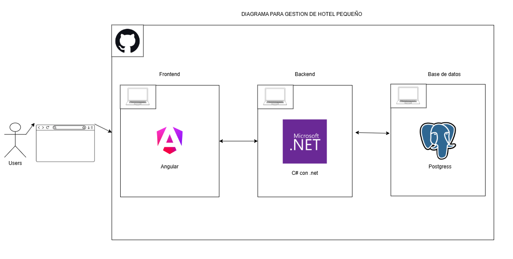
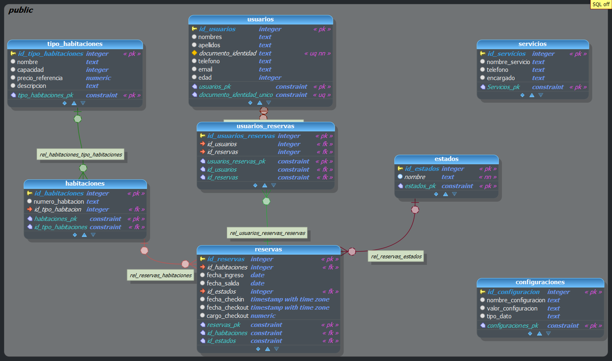

#  Sistema de Reservas para Hotel Pequeño

**Materia:** Taller de Diseño de Software 1  
**Tipo:** Prototipo académico (MVP — 1 semana)  
**Modalidad:** Individual

---

##  Descripción General de la Solución

Sistema web de gestión de reservas para un hotel pequeño, desarrollado como prototipo funcional académico. La solución permite a un recepcionista administrar huéspedes, crear y consultar reservas, realizar operaciones de check-in/check-out con recargo por late check-out, cancelar reservas y consultar contactos de servicios del hotel.

El sistema cubre el flujo principal de reservas y atención al huésped: desde el registro de datos del cliente, pasando por la creación de reservas con validaciones de disponibilidad y capacidad, hasta el cierre de la estadía con cálculo automático de cargos por salida tardía.

### Tecnologías Principales

| Capa | Tecnología | Versión |
|------|-----------|---------|
| **Frontend** | Angular | 21 |
| **Backend** | ASP.NET Core (C#) | .NET 10 |
| **Base de datos** | PostgreSQL | — |
| **ORM** | Entity Framework Core | 10.0.5 |
| **Documentación API** | Swagger (Swashbuckle) | 10.1.7 |

---

##  Arquitectura Utilizada

El proyecto implementa una **arquitectura MVC por capas**, separando  entre presentación, control, servicios, repositorios y modelos.

### Diagrama de Arquitectura



### Capas del Sistema

```
┌─────────────────────────────────────────────────────┐
│                   FRONTEND (Angular 21)             │
│      Componentes · Servicios HTTP · Modelos TS      │
└──────────────────────┬──────────────────────────────┘
                       │ HTTP / REST API
┌──────────────────────▼──────────────────────────────┐
│                BACKEND (ASP.NET Core / C#)          │
│                                                     │
│  ┌──────────────────────────────────────────────┐   │
│  │          Controladores (Controllers)         │   │
│  │  ReservaControlador · UsuarioControlador     │   │
│  │  ServicioControlador · TipoHabitacionCtrl    │   │
│  └──────────────────┬───────────────────────────┘   │
│                     │                               │
│  ┌──────────────────▼───────────────────────────┐   │
│  │            Servicios (Services)              │   │
│  │  ReservaServicio · UsuarioServicio           │   │
│  │  ServicioServicio · TipoHabitacionServicio   │   │
│  └──────────────────┬───────────────────────────┘   │
│                     │                               │
│  ┌──────────────────▼───────────────────────────┐   │
│  │          Repositorios (Repository)           │   │
│  │  ReservaRepositorio · UsuarioRepositorio     │   │
│  │  ServicioRepositorio · TipoHabitacionRepo    │   │
│  │  ConfiguracionRepositorio                    │   │
│  └──────────────────┬───────────────────────────┘   │
│                     │                               │
│  ┌──────────────────▼───────────────────────────┐   │
│  │      Modelos / Entidades / DTOs / Enums      │   │
│  │  Reserva · Usuario · Habitacione · Estado    │   │
│  │  TipoHabitacione · Servicio · Configuracione │   │
│  │  UsuariosReserva · CrearReservaDTO           │   │
│  │  RegistrarUsuarioDTO · EstadosReservaEnum    │   │
│  └──────────────────────────────────────────────┘   │
│                                                     │
│  ┌──────────────────────────────────────────────┐   │
│  │          Cache (Patrón Singleton)            │   │
│  │            TipoHabitacionCache               │   │
│  └──────────────────────────────────────────────┘   │
└──────────────────────┬──────────────────────────────┘
                       │ Entity Framework Core (Npgsql)
┌──────────────────────▼──────────────────────────────┐
│              BASE DE DATOS (PostgreSQL)              │
│                   hotel_pequeno                      │
└─────────────────────────────────────────────────────┘
```

### Patrones de Diseño Aplicados

| Patrón | Uso en el Proyecto |
|--------|-------------------|
| **Repository** | Cada módulo posee una interfaz (`IReservaRepositorio`, `IUsuarioRepositorio`, etc.) y su implementación concreta, encapsulando el acceso a datos y desacoplándolo de la lógica de negocio. |
| **Service Layer** | Las interfaces de servicio (`IReservaServicio`, `IUsuarioServicio`, etc.) centralizan las reglas de negocio (validaciones de fechas, solapamiento, capacidad, late check-out) separadas de los controladores. |
| **Singleton** | `TipoHabitacionCache` implementa el patrón Singleton para mantener en memoria los tipos de habitación y evitar consultas repetidas a la base de datos. |
| **DTO (Data Transfer Object)** | `CrearReservaDTO` y `RegistrarUsuarioDTO` encapsulan los datos de entrada de la API, incluyendo métodos de mapeo (`MapearAReserva`, `Mapear`) para transformarlos en entidades del dominio. |
| **Dependency Injection** | Todas las dependencias (servicios, repositorios) se registran en `Program.cs` con `AddScoped` y se inyectan vía constructor, siguiendo el principio de inversión de dependencias. |

### Estructura del Proyecto

```
Examen-hotel-pequeno/
├── Backend/
│   └── Backend/
│       ├── Controladores/          # Endpoints de la API REST
│       ├── Servicios/              # Lógica de negocio
│       │   ├── Reserva/
│       │   ├── Usuario/
│       │   ├── TipoHabitacion/
│       │   └── Servicio/
│       ├── Repositorio/            # Acceso a datos
│       │   ├── Reserva/
│       │   ├── Usuario/
│       │   ├── TipoHabitacion/
│       │   ├── Servicio/
│       │   └── Configuracion/
│       ├── Modelos/
│       │   ├── Entidades/          # Clases mapeadas a tablas (EF Core)
│       │   ├── DTOs/               # Objetos de transferencia de datos
│       │   └── Enums/              # Enumeraciones (estados de reserva)
│       ├── Cache/                  # Patrón Singleton (TipoHabitacionCache)
│       └── Program.cs             # Punto de entrada y configuración DI
├── frontend/
│   └── src/
│       └── app/
│           ├── Components/         # Componentes Angular
│           │   ├── reservas/       # Módulo de reservas
│           │   ├── usuarios/       # Módulo de huéspedes
│           │   ├── servicios-hotel/ # Contactos de servicios
│           │   ├── side-bard/      # Barra lateral de navegación
│           │   ├── tabla-generica/ # Componente reutilizable de tabla
│           │   └── pantallas_avisos/ # Mensajes y alertas
│           ├── Services/api/       # Servicios HTTP para consumir API
│           ├── Models/             # Interfaces y DTOs TypeScript
│           └── app.routes.ts       # Definición de rutas
├── Database/
│   └── Database.backup             # Respaldo de la base de datos
└── img/
    ├── Arquitectura.png            # Diagrama de arquitectura
    └── Database.png                # Diagrama de base de datos
```

---

##  Modelo de Base de Datos

La base de datos `hotel_pequeno` está implementada en **PostgreSQL** y consta de **8 tablas** con las siguientes relaciones:

### Diagrama Entidad-Relación



### Descripción de las Tablas

#### `usuarios`
Almacena los datos de los huéspedes registrados.

| Columna | Tipo | Restricción |
|---------|------|-------------|
| `id_usuarios` | integer | PK, auto-incremental |
| `nombres` | text | — |
| `apellidos` | text | — |
| `documento_identidad` | text | **UNIQUE**, NOT NULL |
| `telefono` | text | — |
| `email` | text | — |
| `edad` | integer | — |

#### `tipo_habitaciones`
Catálogo precargado con los tipos de habitación del hotel.

| Columna | Tipo | Restricción |
|---------|------|-------------|
| `id_tipo_habitaciones` | integer | PK, auto-incremental |
| `nombre` | text | — |
| `capacidad` | integer | — |
| `precio_referencia` | numeric | — |
| `descripcion` | text | — |

> **Tipos disponibles:** Simple, Suite, Doble con camas individuales, Doble matrimonial.

#### `habitaciones`
Habitaciones físicas del hotel, vinculadas a un tipo.

| Columna | Tipo | Restricción |
|---------|------|-------------|
| `id_habitaciones` | integer | PK, auto-incremental |
| `numero_habitacion` | text | — |
| `id_tipo_habitacion` | integer | FK → `tipo_habitaciones` |

#### `estados`
Catálogo de estados posibles para una reserva.

| Columna | Tipo | Restricción |
|---------|------|-------------|
| `id_estados` | integer | PK, auto-incremental |
| `nombre` | text | NOT NULL |

> **Estados:** Disponible (1), Ocupado (2), Reservado (3), Cancelado (4), Finalizado (5).

#### `reservas`
Registra las reservas de habitaciones con su ciclo de vida completo.

| Columna | Tipo | Restricción |
|---------|------|-------------|
| `id_reservas` | integer | PK, auto-incremental |
| `id_habitaciones` | integer | FK → `habitaciones` |
| `fecha_ingreso` | date | — |
| `fecha_salida` | date | — |
| `id_estados` | integer | FK → `estados` |
| `fecha_checkin` | timestamp with time zone | — |
| `fecha_checkout` | timestamp with time zone | — |
| `cargo_checkout` | numeric | — |

#### `usuarios_reservas`
Tabla intermedia (N:M) que asocia múltiples huéspedes a una reserva.

| Columna | Tipo | Restricción |
|---------|------|-------------|
| `id_usuarios_reservas` | integer | PK, auto-incremental |
| `id_usuarios` | integer | FK → `usuarios` |
| `id_reservas` | integer | FK → `reservas` |

#### `servicios`
Catálogo precargado de contactos de servicios del hotel.

| Columna | Tipo | Restricción |
|---------|------|-------------|
| `id_servicios` | integer | PK, auto-incremental |
| `nombre_servicio` | text | — |
| `telefono` | text | — |
| `encargado` | text | — |

#### `configuraciones`
Parámetros del sistema (hora límite de check-out, porcentaje de recargo, etc.).

| Columna | Tipo | Restricción |
|---------|------|-------------|
| `id_configuracion` | integer | PK, auto-incremental |
| `nombre_configuracion` | text | — |
| `valor_configuracion` | text | — |
| `tipo_dato` | text | — |

### Relaciones Principales

```
tipo_habitaciones  1 ──── N  habitaciones
habitaciones       1 ──── N  reservas
estados            1 ──── N  reservas
usuarios           N ──── N  reservas   (a través de usuarios_reservas)
```

---

##  Funcionalidades Implementadas

Se implementaron **7 historias de usuario**: las 6 historias base obligatorias (HU-01 a HU-06) y la historia individual asignada HU-08.

### HU-01 — Registrar Huésped
- Formulario de registro con campos: nombres, apellidos, documento de identidad, teléfono, email, edad.
- **Validación de campos obligatorios** al intentar guardar.
- **Control de duplicados** por documento de identidad (restricción UNIQUE en BD).
- Mensajes de error descriptivos al usuario.

### HU-02 — Crear Reserva de Habitación
- Formulario de reserva que asocia huéspedes, habitación y fechas de estadía.
- **Validación de fechas:** la fecha de salida debe ser posterior a la de ingreso.
- **Control de solapamiento:** impide reservar una habitación que ya está ocupada en el rango de fechas seleccionado.
- **Validación de capacidad:** rechaza la operación si la cantidad de huéspedes supera la capacidad de la habitación.
- Consulta de disponibilidad de habitaciones por rango de fechas.

### HU-03 — Consultar Reservas Activas y Futuras
- Listado de todas las reservas con datos principales (huéspedes, habitación, fechas, estado).
- Reservas presentadas ordenadas cronológicamente por fecha de ingreso.
- Mensaje informativo cuando no existen reservas para mostrar.

### HU-04 — Registrar Check-in
- Registro de fecha y hora de ingreso del huésped.
- **Validación de estado:** solo permite check-in en reservas con estado "Reservado".
- **Prevención de duplicados:** impide registrar check-in si ya fue realizado.
- Cambio automático de estado a "Ocupado" tras el check-in exitoso.

### HU-05 — Gestionar Variación de Tipo de Habitación (con Patrón de Diseño)
- Selección de tipo de habitación al crear una reserva con opciones: **Simple, Suite, Doble con camas individuales, Doble matrimonial**.
- Asignación automática de características (capacidad, descripción, precio referencial) según el tipo seleccionado.
- Uso del patrón **Singleton** (`TipoHabitacionCache`) para cachear los tipos de habitación en memoria.
- Validación de selección obligatoria de tipo de habitación.

### HU-06 — Visualizar Contactos de Servicios del Hotel
- Listado de contactos de servicios del hotel (datos precargados en BD).
- Muestra: nombre del servicio, encargado y teléfono.
- Mensaje informativo cuando no hay contactos disponibles.

### HU-08 — Registrar Check-out con Late Check-out
- Registro de fecha y hora de salida del huésped.
- **Validación de check-in previo:** impide check-out sin haber realizado check-in.
- **Cálculo automático de recargo por late check-out:** si la salida ocurre después del horario límite configurado (`hora_limite_checkout`), se aplica un porcentaje de recargo (`porcentaje_late_checkout`) sobre el precio de referencia del tipo de habitación.
- Los parámetros de hora límite y porcentaje de recargo se obtienen de la tabla `configuraciones`.
- Cambio automático de estado a "Finalizado" tras el check-out.

---

##  API Endpoints

| Método | Ruta | Descripción |
|--------|------|-------------|
| `POST` | `/UsuarioControlador/RegistrarUsuario` | Registrar un nuevo huésped |
| `GET` | `/UsuarioControlador/ObtenerUsuarios` | Listar todos los huéspedes |
| `POST` | `/ReservaControlador/CrearReserva` | Crear una nueva reserva |
| `GET` | `/ReservaControlador/ObtenerReservas` | Listar todas las reservas |
| `GET` | `/ReservaControlador/Disponibilidad?ingreso=&salida=` | Consultar habitaciones disponibles |
| `PUT` | `/checkin/{idReserva}` | Registrar check-in |
| `PUT` | `/checkout/{idReserva}` | Registrar check-out |
| `PUT` | `/cancelar/{id}` | Cancelar una reserva |
| `GET` | `/TipoHabitacionControlador/Opciones` | Obtener tipos de habitación |
| `GET` | `/ServicioControlador/Contactos` | Obtener contactos de servicios |

> **Swagger UI** disponible en desarrollo: `http://localhost:5052/swagger/index.html`

---

##  Instrucciones para Ejecutar el Sistema

### Prerrequisitos

- [.NET 10 SDK](https://dotnet.microsoft.com/download)
- [Node.js](https://nodejs.org/) (v18+)
- [PostgreSQL](https://www.postgresql.org/)
- [Angular CLI](https://angular.io/cli) (`npm install -g @angular/cli`)

### 1. Base de Datos

1. Crear una base de datos llamada `hotel_pequeno` en PostgreSQL.
2. Restaurar el respaldo ubicado en `Database/Database.backup`:
   ```bash
   pg_restore -U postgres -d hotel_pequeno Database/Database.backup
   ```
3. Verificar que la cadena de conexión en `Backend/Backend/Program.cs` coincida con tu configuración local:
   ```
   Host=localhost;Database=hotel_pequeno;Username=postgres;Password=273153
   ```

### 2. Backend

```bash
cd Backend/Backend
dotnet restore
dotnet run
```

El servidor se iniciará y Swagger estará disponible en `http://localhost:5052/swagger/index.html`.

### 3. Frontend

```bash
cd frontend
npm install
ng serve
```

La aplicación estará disponible en `http://localhost:4200`.
